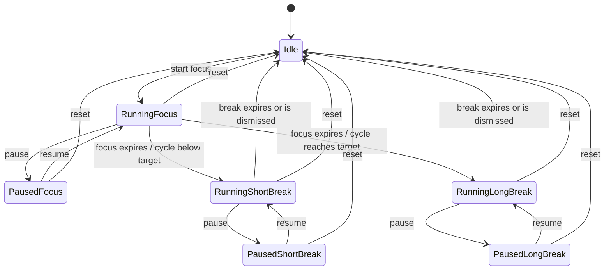

# ADR 0001: Tauri and Rust migration architecture

- Status: Proposed
- Date: 2026-08-05
- Decision owners: Yasumi Clock maintainers
- Parent epic: [#12](https://github.com/MrXnneHang/Yasumi-Clock/issues/12)
- Phase 0 issue: [#13](https://github.com/MrXnneHang/Yasumi-Clock/issues/13)

## Context

Yasumi Clock is currently a Python desktop application built with PyQt5 and
packaged with PyInstaller. Its product behavior now spans more than a countdown:
it has classic and preset focus modes, pause and recovery behavior, multiple
always-on-top windows, media playback, reminders, autostart, session logging,
and platform-specific sleep and window handling.

The current implementation proves the product behavior, but its boundaries are
largely PyQt boundaries. For example, timer state is expressed through QObject
signals, pause is modeled as another state object, window orchestration lives in
the main widget controller, configuration and unrelated platform services share
`util.py`, and media is decoded into frames on worker threads. Copying those
structures directly into Tauri would preserve accidental complexity rather than
the product.

This ADR defines the behavior baseline and the target architecture before any
Tauri application is scaffolded. It is intentionally documentation-only. The
legacy Python implementation remains the production implementation until the
replacement passes the migration epic's acceptance matrix.

## Decision drivers

1. The timer must remain correct when the webview is busy, the app is in the
   background, the computer sleeps, or wall-clock time changes.
2. Rust business logic must be testable without starting Tauri or a webview.
3. Frontend/backend communication needs one typed, ordered source of truth.
4. Auxiliary windows need explicit ownership, singleton rules, and close policy.
5. Windows, macOS, and Linux differences must be isolated behind platform ports.
6. Existing settings and session logs must migrate without destroying user data.
7. New names should describe the domain rather than preserve ambiguous legacy
   class and function names.
8. The migration must be incremental; a working Python release remains available
   until the Tauri version is validated.

## Decisions

### 1. Technology and responsibility split

The replacement will use:

- **Tauri 2** for the desktop runtime, native windows, application lifecycle,
  capabilities, and plugin integration;
- **Rust** for authoritative timer state, transitions, persistence, application
  effects, window orchestration, audio orchestration, and platform adapters;
- **React + TypeScript + Vite** for rendering, accessibility, settings forms,
  user interaction, and visual media playback.

React is not an authority for elapsed time. A webview may animate the displayed
value between snapshots, but it must replace that value whenever a Rust
`TimerSnapshot` arrives. Reloading or closing a webview must not stop the timer.

HTML media elements replace Python frame extraction for bundled MP4/GIF assets.
The frontend reports media load errors but does not decode video in Rust unless a
later platform test demonstrates a WebView codec incompatibility.

### 2. Layered architecture

The Rust code will use dependency direction toward a Tauri-independent domain:

```text
src-tauri/src/
  lib.rs
  domain/
    timer/
      mod.rs
      model.rs
      reducer.rs
    progress.rs
    session.rs
    settings.rs
  application/
    focus_timer.rs
    effects.rs
    ports.rs
  infrastructure/
    clock.rs
    config/
      mod.rs
      legacy_yaml.rs
      versioned_json.rs
    persistence.rs
    session_log.rs
    audio.rs
    platform/
      mod.rs
      autostart.rs
      power.rs
  tauri_api/
    commands.rs
    error.rs
    events.rs
    state.rs
    window_coordinator.rs
```

The boundaries are:

- `domain` contains value types, invariants, and deterministic transitions. It
  has no Tauri dependency and performs no file, window, audio, or clock I/O.
- `application` executes use cases around the domain and turns transitions into
  explicit `AppEffect` values. It depends on traits in `ports.rs`.
- `infrastructure` implements clocks, storage, migration, logs, audio, and
  platform-specific ports.
- `tauri_api` owns managed state, command adapters, event publication, Tauri
  capabilities, and window lifecycle integration.

A single application service named `FocusTimer` owns timer mutations. Tauri
managed state wraps that service in an asynchronous lock. No command may hold a
lock while awaiting frontend input or a long-running media operation.

The frontend mirrors the same feature boundaries:

```text
src/
  app/
  features/
    timer/
    settings/
    rest-overlay/
    last-minute-overlay/
    idle-reminder/
    audio-control/
  shared/
    ipc/
    ui/
```

There will be no new generic `util`, `helpers`, or `manager` module. Shared code
must be named after its responsibility.

### 3. Domain vocabulary and naming

`Yasumi` remains the product name. Internal domain names use English terms with
one meaning each.

#### Core vocabulary

| Term | Meaning |
|---|---|
| Focus session | One timed work interval |
| Break session | One timed short or long rest interval |
| Session phase | The kind of active/paused interval: focus, short break, or long break |
| Timer status | Whether the timer is idle, running, or paused |
| Timer mode | Classic manual-duration behavior or a configured preset |
| Cycle progress | Completed focus sessions since the previous long break |
| Daily focus progress | Completed focus sessions in the logical day; it does not reset after a long break |
| Rest overlay | The large window displayed during a break |
| Timer snapshot | The complete immutable state sent to a frontend |
| Session record | One completed or interrupted focus/break log row |

#### Legacy-to-target mapping

| Legacy name | Target name | Reason |
|---|---|---|
| `PomodoroEngine` | `FocusTimer` | Owns all focus timer modes, not only one Pomodoro preset |
| `PomodoroState` | reducer over `TimerState` | Transitions become explicit data rather than QObject subclasses |
| `IdleState` | `TimerStatus::Idle` | Idle is lifecycle status, not a session phase |
| `WorkingState` | `SessionPhase::Focus` | “Working” is ambiguous and inconsistent with session records |
| `ShortBreakState` | `SessionPhase::ShortBreak` | Phase is separated from running/paused status |
| `LongBreakState` | `SessionPhase::LongBreak` | Phase is separated from running/paused status |
| `PausedState` | `TimerStatus::Paused` | Pause retains the current phase instead of wrapping a previous state |
| `OperatingMode` | `TimerMode` | Presets are data-driven rather than enum variants |
| `pomodoro_count` | `cycle_focus_count` and `daily_completed_focus_count` | The legacy field mixes cycle progress with daily progress |
| `Main_Window_Response` | `AppController` responsibilities split across application service and React features | The class currently combines view controller and orchestration roles |
| `Main_Window_UI` | `MainTimerView` | Standard type casing and a UI-specific responsibility |
| `yasumiWindow` | `RestOverlay` | “Yasumi” is branding; the window's purpose is rest enforcement |
| `FloatingWindow` | `LastMinuteOverlay` | Names why and when it appears |
| `IdleReminderWindow` | `IdleReminderOverlay` | Consistent auxiliary-window vocabulary |
| `StopSoundWindow` | `AudioControlOverlay` | Describes control of active notification playback |
| `ConfigManager` | `SettingsRepository`, `RuntimeStateRepository`, and `ResourceLocator` | Splits unrelated persistence and resource responsibilities |
| `SoundService` / `SoundPlayer` | `AudioService` / `AudioOutput` | Separates application orchestration from device playback |
| `AnimationService` / `DrawAnimationThread` | React `SessionAnimation` | Web media replaces frame-thread management |
| `show_window_on_top` | `WindowCoordinator::show_overlay` plus platform adapter | Encapsulates singleton and platform rules, not only z-order |
| `log_session` | `SessionLog::append` | Names the target and operation |
| `util.py` | responsibility-specific modules | Catch-all modules are not carried forward |

Rust follows standard `UpperCamelCase` types, `snake_case` modules/functions,
and explicit unit suffixes such as `_seconds` and `_minutes`. TypeScript uses
`PascalCase` components/types, `camelCase` values, and `useX` hooks. Serialized
IPC uses `camelCase` through Serde. Event names use lower-case namespaced strings.
Abbreviations are limited to established protocol terms such as `UTC` in prose;
identifiers use `utc`.

Legacy Python names are not mass-renamed as part of this migration phase. They
remain useful for comparing behavior while the new implementation is built.

### 4. State model and invariants

Pause is status, not phase:

```rust
#[derive(Clone, Copy, Debug, Eq, PartialEq, Serialize)]
#[serde(rename_all = "camelCase")]
pub enum TimerStatus {
    Idle,
    Running,
    Paused,
}

#[derive(Clone, Copy, Debug, Eq, PartialEq, Serialize)]
#[serde(rename_all = "camelCase")]
pub enum SessionPhase {
    Focus,
    ShortBreak,
    LongBreak,
}

#[derive(Clone, Debug, Eq, PartialEq, Serialize)]
#[serde(tag = "kind", content = "presetId", rename_all = "camelCase")]
pub enum TimerMode {
    Classic,
    Preset(PresetId),
}
```

`TimerState` maintains these invariants:

| Status | Current phase | Deadline | Paused remaining |
|---|---|---|---|
| Idle | None | None | None |
| Running | Some | Some | None |
| Paused | Some | None | Some |

Other state includes the selected mode, classic focus duration,
`cycle_focus_count`, `daily_completed_focus_count`, logical-day key, current
session metadata, and an increasing snapshot revision.

Preset definitions are data. Adding a student, professional, or future preset
must not require adding a Rust enum variant. A preset focus duration supports
both a fixed duration and an explicit per-cycle sequence because the legacy
engine accepts scalar and list-valued `work_mins`.

Classic mode uses a manually selected focus duration and a fixed five-minute
break. The migration preserves the current 20-minute default and five-minute
steps through 40 minutes, but removes the zero-minute selectable duration as an
invalid legacy edge case. Expanding the duration range is a separate product
change.

#### State transitions



The reducer defines these user-facing actions explicitly:

| Current status / phase | Allowed actions | Result |
|---|---|---|
| Idle | Start focus; adjust classic duration; change settings | Start creates a running focus; duration adjustment/settings keep the timer idle |
| Running focus | Pause; reset | Pause retains focus and remaining duration; reset interrupts the session and returns idle |
| Paused focus | Resume; reset | Resume creates new deadlines; reset interrupts the session and returns idle |
| Running non-forced break | Pause; dismiss; reset | Pause retains the break; dismiss/reset logs interruption and returns idle |
| Paused non-forced break | Resume; dismiss; reset | Resume creates new deadlines; dismiss/reset logs interruption and returns idle |
| Running or paused forced break | Pause/resume as applicable; reset only through trusted app lifecycle | Ordinary dismiss is rejected; reset is not exposed by the overlay |

Settings that alter active timing semantics cannot be committed while a focus or
break is running/paused. Non-timing settings may be committed immediately. This
replaces the legacy settings dialog's implicit reset rules with an explicit
validation contract.

`reset` records an active session as interrupted, clears the active session and
cycle progress, hides timer overlays, and returns to idle. It does **not** erase
`daily_completed_focus_count`; daily history and cycle progress are separate in
the new model.

A completed focus increments both cycle progress and daily focus progress. If
cycle progress reaches the preset threshold, the next phase is a long break and
cycle progress resets when that long break begins. Otherwise, the next phase is
a short break. Completing or dismissing a break returns to idle; the next focus
never starts automatically.

A non-forced break may be dismissed and is logged as interrupted. A forced break
rejects ordinary dismiss requests but cannot and does not attempt to prevent the
operating system, task manager, activity monitor, logout, or shutdown from
terminating the process.

### 5. Timing semantics

#### Running in one process

A running session stores both:

- a monotonic deadline for correct in-process elapsed time; and
- a UTC start/deadline anchor for persistence and cross-sleep reconciliation.

The scheduler wakes approximately once per second and asks the domain for a new
snapshot. It never mutates state by blindly subtracting one second. Remaining
time is derived from the clock and clamped at zero.

The frontend may render intermediate animation, but it does not run the state
machine. A delayed webview event therefore changes display latency, not timer
truth.

#### Pause and resume

Pausing computes and stores the remaining duration using the monotonic clock,
clears the deadlines, and keeps the session phase. Paused time does not count
toward the session's actual duration. Resuming creates fresh monotonic and UTC
deadlines from the stored duration.

#### Shutdown and restart

On orderly shutdown, active or paused runtime state is written atomically. A
running session continues to elapse while the application is closed; a paused
session does not.

At startup, the application reconciles a persisted running session against UTC:

1. If its deadline is still in the future, restore it as **paused** with the
   reconciled remaining duration and wait for explicit user action, preserving
   the current user-facing recovery behavior.
2. If a focus deadline passed, record the focus as completed and consume elapsed
   overrun through its short/long break.
3. If that break also passed, record it as completed and finish in idle.
4. Never start another focus automatically.
5. If a persisted break deadline passed, record it as completed and finish in
   idle.

This same reconciliation algorithm is used after system sleep, removing the
legacy difference between restart and macOS wake handling.

The legacy one-hour expiry rule is not retained: a valid running session is
reconciled regardless of age. Corrupt or unsupported runtime state is
quarantined and the app starts idle.

#### Sleep, wake, and wall-clock changes

The application records the relationship between monotonic and UTC clocks. On a
power wake event, process resume, and periodic scheduler check, it compares both
elapsed deltas:

- ordinary scheduling uses monotonic time;
- a material discrepancy indicating sleep uses UTC reconciliation;
- a backward UTC jump never increases remaining time; it is recorded as a clock
  anomaly and monotonic time remains authoritative for the running process;
- a forward UTC jump is reconciled as elapsed real time, potentially completing
  the focus and break as described above.

Platform power notifications are an optimization for prompt UI updates, not the
only correctness mechanism.

#### Logical day

The logical day changes at local **05:00**, retaining existing behavior. Daily
focus progress is keyed by that logical date. If a focus starts before 05:00 and
finishes after it, completion belongs to the logical day at completion time.
Timezone changes are evaluated from the current local timezone when completion
is recorded.

### 6. Application effects

A domain transition returns state plus explicit effects instead of directly
opening windows or playing media:

```rust
pub enum AppEffect {
    PublishTimerSnapshot,
    PersistRuntimeState,
    AppendSessionRecord(SessionRecord),
    ShowRestOverlay { force: bool },
    HideRestOverlay,
    ShowLastMinuteOverlay,
    HideLastMinuteOverlay,
    PlayNotification,
    StartWhiteNoise,
    StopWhiteNoise,
    ArmIdleReminder,
    CancelIdleReminder,
}
```

The application layer orders and executes these effects through ports. The Tauri
window coordinator consumes window effects. This prevents frontend components
from inventing state transitions and keeps all windows synchronized with one
canonical state.

### 7. Current behavior baseline and disposition

`Retain` means preserve product semantics. `Replace` means preserve the outcome
through a new implementation. `Merge` consolidates UI or responsibilities.
`Remove` deliberately drops accidental or invalid behavior.

| Current capability | Disposition | Target behavior |
|---|---|---|
| Classic manual timer | Retain | Rust timer with 20-minute default, 5-minute steps, and fixed 5-minute break |
| Zero-minute classic option | Remove | Reject zero-duration sessions |
| Custom/student/professional/fragmented presets | Retain | Data-driven preset IDs, not Rust enum variants |
| Scalar/list focus durations | Retain | Typed fixed or sequence duration plan |
| Start, pause, resume, reset | Retain | Explicit commands and deterministic reducer transitions |
| Focus → short/long break rules | Retain | Threshold-driven cycle progress |
| One field used for cycle and “daily” count | Replace | Separate cycle progress and cumulative logical-day progress |
| Main-window progress dots | Retain | Render from cycle progress snapshot fields |
| Unfinished-session recovery | Replace | Atomic state plus consistent UTC reconciliation; restore future session paused |
| One-hour recovery expiry | Remove | Valid state is reconciled regardless of age |
| macOS-only sleep compensation | Replace | Cross-platform clock reconciliation; native power adapters where available |
| Work/break MP4 animation threads | Replace | Browser-native media playback controlled by snapshot phase |
| Loading GIF/window for frame decoding | Remove | Main UI starts directly with normal loading/fallback states |
| Break GIF window | Replace | `RestOverlay` webview using bundled media |
| Forced break | Retain | Prevent ordinary dismiss/close; document OS-level limitation |
| Last-minute floating window | Retain | Singleton `LastMinuteOverlay`, optional, draggable, configurable |
| Idle reminder and repeated reminder | Retain | Application scheduler and singleton overlay/audio effects |
| End notification and loop modes | Retain | Rust audio service plus `AudioControlOverlay` |
| White noise during focus | Retain | Audio effect follows running focus status |
| Audio output device selection | Retain, spike required | Rust audio backend after cross-platform device-name/ID testing |
| Settings modal window | Merge | Main webview settings route/modal with staged save/cancel behavior |
| Autostart and startup minimization | Retain | Tauri autostart plugin plus startup intent handling |
| Open application data directory | Retain | Narrow Tauri command opens the resolved directory |
| CSV session history | Retain | Preserve columns and append semantics |
| YAML defaults and user overlay | Replace | Versioned JSON runtime/settings with read-only YAML importer |
| Daily log boundary at 05:00 | Retain | Dedicated logical-day value and tests |
| PyInstaller specs and Python CI | Retain during migration | Removed only after Tauri reaches release acceptance |
| Manual animation-layout tool | Remove | CSS layout replaces fixed frame coordinates |

### 8. Window lifecycle decisions

All auxiliary windows are Rust-owned named singletons. Repeated show requests
focus/update the existing instance instead of creating another webview.

| Target window | Current source | Create/show condition | Hide/destroy condition | Decorations / taskbar | Always on top | Decision |
|---|---|---|---|---|---|---|
| `main` | `yasumi_clock.py`, `MainWindowUI.py` | Application startup; minimized according to startup intent/settings | Normal close exits after persistence; during forced rest, close hides main | Standard / shown | No | Retain |
| settings view | `SettingsWindow.py` | User opens settings in `main` | Save, cancel, navigation | Same as main | No | Merge into main webview |
| `rest-overlay` | `yasumi_window.py` | Running short/long break begins or is restored | Break completes; non-forced user dismisses; app exits | Forced: frameless/taskbar-hidden. Normal: closeable | Yes | Retain as `RestOverlay` |
| `last-minute-overlay` | `FloatingWindow.py` | Enabled, running focus has 60 seconds or less | Pause, phase change, reset, setting disabled, or app exit | Frameless/taskbar-hidden; draggable | Yes | Retain |
| `idle-reminder-overlay` | `IdleReminderWindow.py` | Idle threshold fires with visual alert enabled | User acknowledges, focus starts, reset, or app exit | Frameless/taskbar-hidden | Yes | Retain |
| `audio-control-overlay` | `StopSoundWindow.py` | Looping or long notification playback requires a stop control | Playback ends/stops or app exits | Frameless/taskbar-hidden; draggable | Yes | Retain |
| loading window | `LoadingWindow.py` | Legacy startup frame decoding | Main window appears | Frameless/taskbar-hidden | Yes | Remove |

Window policy details:

- A forced rest close request is cancelled and audited. Closing `main` while the
  forced overlay is visible hides `main`; the process continues until the break
  completes or the OS terminates it.
- Normal break dismissal produces a timer transition; it is not merely a
  frontend `close()` call.
- Overlay position uses the monitor containing the main window, falling back to
  the primary monitor. Saved position is clamped to a currently visible work
  area after monitor or DPI changes.
- The rest overlay targets five-sixths of its monitor as the legacy window does,
  but uses responsive layout rather than fixed animation geometry.
- macOS full-screen Space visibility and Linux compositor/window-manager z-order
  require platform acceptance tests; core Tauri flags alone are not treated as
  proof of parity.

### 9. IPC contract

The Serde representation in Rust is the wire source of truth. TypeScript mirrors
it under `src/shared/ipc`. Contract fixtures serialize representative Rust
values and are consumed by TypeScript tests. Automated binding generation may be
adopted later, but is not required to start Phase 1.

#### Snapshot

```rust
#[derive(Clone, Debug, Serialize)]
#[serde(rename_all = "camelCase")]
pub struct TimerSnapshot {
    pub revision: u64,
    pub status: TimerStatus,
    pub phase: Option<SessionPhase>,
    pub mode: TimerMode,
    pub remaining_seconds: u64,
    pub deadline_utc: Option<String>,
    pub cycle_focus_count: u32,
    pub cycle_target: Option<u32>,
    pub daily_completed_focus_count: u32,
    pub next_phase: Option<SessionPhase>,
    pub allowed_actions: Vec<TimerAction>,
}
```

Every mutation increments `revision`. Frontends ignore snapshots older than the
latest revision. Each webview subscribes before calling `get_timer_snapshot`, so
the initial command also closes the event-listener race.

#### Commands

Command names are Rust `snake_case`; argument and response fields serialize as
`camelCase`.

| Command | Request | Response | Main validation/errors |
|---|---|---|---|
| `get_timer_snapshot` | none | `TimerSnapshot` | state unavailable |
| `start_focus_session` | optional classic duration override | `TimerSnapshot` | not idle, invalid duration, unknown preset |
| `pause_timer` | none | `TimerSnapshot` | not running |
| `resume_timer` | none | `TimerSnapshot` | not paused |
| `reset_timer` | none | `TimerSnapshot` | persistence/log error is reported after safe in-memory reset |
| `dismiss_rest_overlay` | none | `TimerSnapshot` | not in break, forced rest |
| `adjust_classic_focus_duration` | `deltaMinutes` | `TimerSnapshot` | wrong mode/status or out of range |
| `get_settings` | none | `AppSettings` | load/validation failure |
| `update_settings` | full versioned settings + expected revision | `SettingsSnapshot` | stale revision or validation failure |
| `get_audio_outputs` | none | `AudioOutputDescriptor[]` | backend unsupported/unavailable |
| `test_notification_audio` | staged audio settings | playback state | invalid device/media or playback failure |
| `stop_audio` | none | playback state | none; idempotent |
| `set_autostart_enabled` | `enabled` | autostart state | unsupported/permission/platform failure |
| `get_autostart_state` | none | autostart state | platform query failure |
| `open_app_data_directory` | none | empty success | directory/shell-open failure |

Window creation and arbitrary filesystem paths are not exposed as generic
frontend commands. Capabilities grant each webview only the commands it needs.

#### Events

| Event | Payload | Audience / purpose |
|---|---|---|
| `timer://snapshot` | `TimerSnapshot` | All timer-rendering webviews; one complete ordered source of truth |
| `settings://changed` | `SettingsSnapshot` | Main/settings UI and services affected by committed settings |
| `reminder://idle-triggered` | `IdleReminderSnapshot` | Idle overlay presentation only; Rust already owns scheduling |
| `audio://playback-changed` | `AudioPlaybackSnapshot` | Main/settings/audio-control views |
| `migration://attention-required` | safe migration error summary | Main UI; never includes secret file contents |

A one-hertz snapshot event is sufficiently low volume for Tauri's JSON event
system. Channels are reserved for higher-throughput streams such as future audio
metering, not normal timer ticks. Commands return structured errors:

```rust
#[derive(Debug, Serialize)]
#[serde(rename_all = "camelCase")]
pub struct CommandError {
    pub code: String,
    pub message: String,
    pub retryable: bool,
}
```

User-facing messages are localized in the frontend from stable error codes;
backend `message` is diagnostic and safe to log.

### 10. Settings, runtime state, and legacy migration

The new application uses separate versioned files:

```text
app config directory/
  settings.v1.json
  migration-state.json

app data directory/
  runtime-state.v1.json
  pomodoro_log.csv
  yasumi.log
  migration-backups/
```

Bundled defaults are deserialized into the same strongly typed `AppSettings`
structure, then user settings override only documented fields. Unknown fields in
a newer JSON schema cause a safe “unsupported version” result rather than being
silently discarded.

#### Legacy locations

The importer checks the paths used by `ConfigManager`:

- source/development: `<legacy working directory>/.dev_user_data/user_config.yml`;
- Windows: `%APPDATA%/YasumiClock/user_config.yml`;
- macOS: `~/Library/Application Support/YasumiClock/user_config.yml`;
- Linux: `~/.config/YasumiClock/user_config.yml`.

The source/development path is accepted only when explicitly running a migration
or development build; production does not scan arbitrary working directories.

#### Migration algorithm

1. If a successful migration marker for the legacy file fingerprint exists, do
   nothing.
2. Open the legacy YAML read-only and enforce size/depth limits before parsing.
3. Copy the original bytes to a timestamp-free, content-hash-named backup in
   `migration-backups`; never rewrite the legacy file.
4. Deserialize known fields into a legacy schema, preserving unrecognized fields
   in the backup only.
5. Validate durations, loop counts, volume, preset IDs, paths, and enums. Invalid
   individual optional settings fall back to bundled defaults and produce a
   visible migration report; invalid core structure aborts migration.
6. Map scalar and list-valued `work_mins` into the explicit duration-plan type.
7. Map the legacy `pomodoro_count` to both cycle progress and initial daily
   progress because the legacy file cannot distinguish them. Record that
   approximation in the migration report.
8. Write new JSON to a temporary file, flush it, and atomically replace the
   target file. Runtime state and settings are committed independently.
9. Read the new file back and validate it before writing the success marker.
10. A failed run leaves existing new-format files and the legacy source intact;
    rerunning is safe and idempotent.

The importer preserves current session-log columns:

```text
start_time,end_time,session_type,status,planned_duration_minutes,
actual_duration_seconds,pause_duration_seconds,pause_count
```

New optional analytics require a versioned log or separate file; existing rows
are not rewritten.

### 11. Platform capability and risk matrix

“Core” means a documented Tauri/window API exists. It does not mean behavior is
accepted until tested on that platform.

| Capability | Windows | macOS | Linux | Decision / risk |
|---|---|---|---|---|
| Frameless, always-on-top, taskbar-hidden overlays | Core; acceptance test | Core; acceptance test | Core; compositor dependent | Configure narrowly per named overlay |
| Cancel ordinary close request | Core; acceptance test | Core; acceptance test | Core; WM shortcuts may vary | Required for forced rest, never advertised as process protection |
| macOS full-screen Space visibility | N/A | Native spike required | N/A | Existing AppKit behavior must be reproduced or explicitly degraded |
| Autostart | Official plugin | Official plugin | Official plugin; desktop environment test | Preserve startup intent and minimized-start settings |
| Sleep/wake notification | Native adapter spike | Native adapter spike | Native/desktop spike | Clock reconciliation remains correctness fallback |
| Audio playback and loop/stop | Rust backend test | Rust backend test | Rust/backend/package test | Select backend after prototype |
| Audio output enumeration | Device-ID stability test | Permission/device test | PipeWire/PulseAudio test | Store stable descriptor where possible, fall back to default device |
| Multi-monitor placement | Core; DPI test | Core; Spaces/DPI test | Core; compositor test | Clamp overlays to active work area |
| DPI/scaling | Webview/core test | Webview/core test | Desktop scaling test | CSS pixels for UI; physical placement via monitor APIs |
| Open app data directory | Shell/open adapter | Shell/open adapter | Shell/open adapter | Expose resolved directory only |
| Bundled MP4/GIF playback | WebView2 codec test | WKWebView test | WebKitGTK/GStreamer test | Provide static fallback image on unsupported codec |
| Installer/build | MSI/NSIS decision in Phase 6 | DMG/app signing/notarization decision | DEB initially | Existing Python workflows remain until replacement acceptance |

The following require explicit technical spikes before Phase 5 implementation is
considered complete:

1. macOS overlay behavior above another application's full-screen Space;
2. Windows/macOS/Linux sleep and wake notifications;
3. output-device enumeration and stable selection across audio backends;
4. WebKitGTK codec availability for the bundled MP4 assets;
5. Linux always-on-top and taskbar behavior under at least the supported desktop
   environments documented at release time.

### 12. Security boundary

Tauri 2 capabilities follow least privilege per window:

- overlay webviews receive timer snapshot events and only their narrow action
  command, if any;
- the main webview receives settings and timer commands;
- no webview receives arbitrary filesystem, shell, process, or window-creation
  access;
- `open_app_data_directory` opens one backend-resolved path;
- bundled assets are allowlisted, and a restrictive Content Security Policy
  disallows remote scripts and frames;
- frontend remote navigation is disabled;
- settings and migration errors never return raw arbitrary file contents.

Capability files and CSP are reviewed as code. Adding a plugin does not imply all
of its commands are granted to all windows.

### 13. Consequences

#### Positive

- Timer behavior can be exhaustively unit-tested without Tauri.
- Webview stalls and frame rate no longer determine elapsed time.
- Pause, session phase, cycle progress, and daily progress have distinct names
  and invariants.
- One versioned snapshot prevents independently ordered signal/event races.
- Explicit effects make window and audio behavior observable in tests.
- Legacy data remains recoverable and migration can be retried safely.
- Platform-specific code is isolated instead of spreading through UI logic.

#### Costs

- The replacement contains more explicit types and adapters than a minimal Tauri
  example.
- Rust and TypeScript IPC representations require contract fixtures and review.
- Clock reconciliation and migration need dedicated tests before UI work can be
  considered trustworthy.
- Some platform parity cannot be proven in CI and requires physical/virtual
  desktop acceptance testing.
- During migration, both Python and Tauri implementations coexist.

### 14. Alternatives considered

#### Copy the PyQt class structure into Rust

Rejected. QObject subclasses, signal fan-out, and widget-owned side effects are
framework artifacts. They would make domain tests depend on Tauri and preserve
ambiguous state semantics.

#### Keep authoritative countdown state in React

Rejected. Browser timers are throttled and webviews may reload. React remains a
projection of Rust state.

#### Emit separate tick, phase, count, and next-step events

Rejected. Consumers can observe events in different orders or miss an event
while mounting. A complete revisioned snapshot is simpler and self-healing.

#### Use wall-clock deadlines only

Rejected. User/NTP clock changes can distort an active countdown. Monotonic time
is authoritative in-process; UTC exists for persistence and sleep reconciliation.

#### Preserve YAML as the primary format

Rejected for new runtime state. Versioned JSON maps directly to Serde and
TypeScript contracts and separates settings from ephemeral runtime state. YAML
remains a read-only compatibility input.

#### Rename and reorganize the legacy Python application first

Rejected. It creates churn without reducing replacement risk and makes behavior
comparison harder. Naming improvements apply to new stable contracts.

## Feature baseline traceability

The decisions above were derived from these current implementation paths:

- timer and recovery: [`pomodoro_engine.py`](../../pomodoro_engine.py),
  [`pomodoro_state.py`](../../pomodoro_state.py), and
  [`mode_enums.py`](../../mode_enums.py);
- main orchestration: [`yasumi_clock.py`](../../yasumi_clock.py);
- main/settings UI: [`MainWindowUI.py`](../../MainWindowUI.py) and
  [`SettingsWindow.py`](../../SettingsWindow.py);
- auxiliary windows: [`yasumi_window.py`](../../yasumi_window.py),
  [`FloatingWindow.py`](../../FloatingWindow.py),
  [`IdleReminderWindow.py`](../../IdleReminderWindow.py),
  [`StopSoundWindow.py`](../../StopSoundWindow.py), and
  [`LoadingWindow.py`](../../LoadingWindow.py);
- config, platform, and audio primitives: [`util.py`](../../util.py),
  [`sound_service.py`](../../sound_service.py), and
  [`animation_service.py`](../../animation_service.py);
- logging and defaults: [`pomodoro_logger.py`](../../pomodoro_logger.py),
  [`yasumi_config.yml`](../../yasumi_config.yml), and [`src.yml`](../../src.yml);
- packaging: [`Yasumi_Clock.spec`](../../Yasumi_Clock.spec),
  [`yasumi_clock_macos.spec`](../../yasumi_clock_macos.spec), and
  [`.github/workflows`](../../.github/workflows).

## Phase boundaries following this ADR

1. Scaffold Tauri 2 + React + TypeScript + Vite without product behavior.
2. Implement the pure Rust state model, reducer, clocks, and unit tests.
3. Add application effects, managed state, typed commands, snapshot events, and
   IPC contract fixtures.
4. Build the main timer/settings UI and browser-native session animation.
5. Add versioned persistence, CSV logging, and read-only legacy migration.
6. Add auxiliary windows and reminder orchestration.
7. Add audio, autostart, power adapters, and platform spikes.
8. Add cross-platform packaging, acceptance tests, migration rollout, and final
   replacement of Python only after parity is demonstrated.

Each implementation phase should be its own issue and small reviewable PRs should
separate scaffolding, domain behavior, adapters, and UI.

## Deferred decisions

These questions are deliberately deferred to a spike or a later ADR because the
current repository cannot prove them:

- the concrete Rust audio crates/backend after output-device and packaging tests;
- native power-event crates/FFI per platform;
- the macOS AppKit mechanism and entitlement implications for full-screen Spaces;
- supported Linux desktop environments and documented degradation behavior;
- MSI versus NSIS as the initial Windows installer;
- whether IPC TypeScript bindings should later be generated rather than fixture
  tested;
- code signing, notarization, and automatic update policy.

Deferring implementation choice does not defer required behavior: each item is a
release blocker for the corresponding acceptance-matrix row unless the release
notes explicitly document a scoped platform limitation.

## Acceptance checklist for Phase 0

- [x] Current features have a retain/replace/merge/remove disposition.
- [x] Every named window has creation, visibility, singleton, close, taskbar, and
      always-on-top policy.
- [x] Timer statuses, phases, allowed transitions, reset, and break dismissal are
      defined.
- [x] Restart, pause, sleep, expiry, and wall-clock semantics are defined.
- [x] Rust/domain, application, infrastructure, Tauri, and React boundaries are
      defined.
- [x] New naming rules and a legacy terminology map are defined.
- [x] Initial command, event, snapshot, and error contracts are defined.
- [x] Versioned persistence and idempotent legacy migration are defined.
- [x] Platform risks and required spikes are identified.
- [x] Non-goals and deferred decisions are explicit.

## References

- [Tauri 2: Create a Project](https://v2.tauri.app/start/create-project/)
- [Tauri 2: Calling Rust from the Frontend](https://v2.tauri.app/develop/calling-rust/)
- [Tauri 2: Calling the Frontend from Rust](https://v2.tauri.app/develop/calling-frontend/)
- [Tauri 2: State Management](https://v2.tauri.app/develop/state-management/)
- [Tauri 2: Window Customization](https://v2.tauri.app/learn/window-customization/)
- [Tauri 2: Capabilities](https://v2.tauri.app/security/capabilities/)
- [Tauri 2: Content Security Policy](https://v2.tauri.app/security/csp/)
- [Tauri 2: Autostart Plugin](https://v2.tauri.app/plugin/autostart/)
- [Tauri 2: JavaScript Path API](https://v2.tauri.app/reference/javascript/api/namespacepath/)
