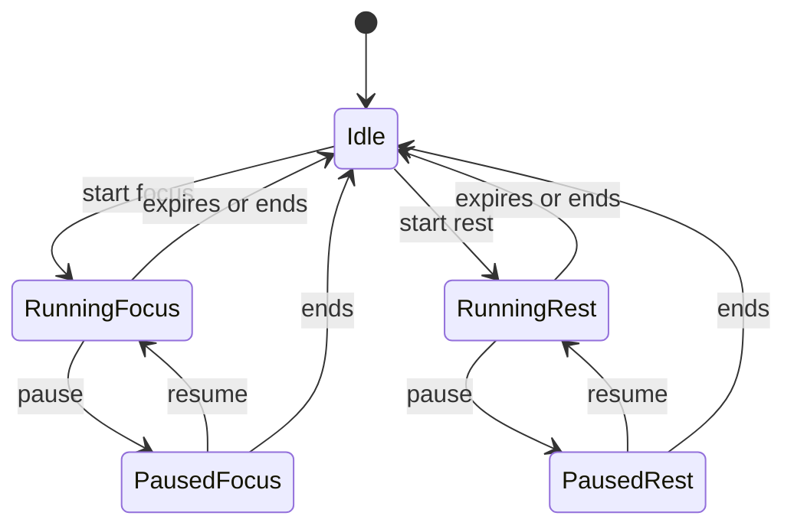

# ADR 0001: Tauri and Rust migration architecture

- Status: Accepted
- Date: 2026-08-05
- Last revised: 2026-08-06
- Decision owners: Yasumi Clock maintainers
- Parent epic: [#12](https://github.com/MrXnneHang/Yasumi-Clock/issues/12)
- Phase 0 issue: [#13](https://github.com/MrXnneHang/Yasumi-Clock/issues/13)

## Context

Yasumi Clock is currently a Python desktop application built with PyQt5 and
packaged with PyInstaller. Its product behavior now spans more than a countdown:
it has configurable focus and rest timers, pause semantics, multiple always-on-top
windows, media playback, reminders, autostart, session logging, and
platform-specific sleep and window handling.

The current implementation proves the product behavior, but its boundaries are
largely PyQt boundaries. For example, timer state is expressed through QObject
signals, pause is modeled as another state object, window orchestration lives in
the main widget controller, configuration and unrelated platform services share
`util.py`, and media is decoded into frames on worker threads. Copying those
structures directly into Tauri would preserve accidental complexity rather than
the product.

This ADR established the behavior baseline and target architecture before the
Tauri scaffold was created. PR #23 through PR #26 have since delivered the first
vertical slice. The 2026-08-06 revision records the subsequent product decision to
replace preset-driven cycles with user-started focus and rest and to insert a
window/visual-polish workstream. It supersedes conflicting cycle, forced-rest,
legacy-import, and restart-restore decisions in the original text.

The document remains architecture-only. The legacy Python implementation remains
the production implementation until the replacement passes the migration epic's
acceptance matrix.

## Decision drivers

1. The timer must remain correct when the webview is busy, the app is in the
   background, the computer sleeps, or wall-clock time changes.
2. Rust business logic must be testable without starting Tauri or a webview.
3. Frontend/backend communication needs one typed, ordered source of truth.
4. Auxiliary windows need explicit ownership, singleton rules, and close policy.
5. Windows, macOS, and Linux differences must be isolated behind platform ports.
6. New settings and session logs must be stored safely without modifying or
   deleting legacy user data.
7. New names should describe the domain rather than preserve ambiguous legacy
   class and function names.
8. The migration must be incremental; a working Python release remains available
   until the Tauri version is validated.

## Decisions

### 1. Technology and responsibility split

The replacement will use:

- **Tauri 2** for the desktop runtime, native windows, application lifecycle,
  capabilities, and plugin integration;
- **Rust** for authoritative timer state, transitions, persistence, application
  effects, window orchestration, audio orchestration, and platform adapters;
- **React + TypeScript + Vite** for rendering, accessibility, settings forms,
  user interaction, and visual media playback.

React is not an authority for elapsed time. A webview may animate the displayed
value between snapshots, but it must replace that value whenever a Rust
`TimerSnapshot` arrives. Reloading or closing a webview must not stop the timer.

HTML media elements replace Python frame extraction for bundled MP4/GIF assets.
The frontend reports media load errors but does not decode video in Rust unless a
later platform test demonstrates a WebView codec incompatibility.

### 2. Layered architecture

The Rust code will use dependency direction toward a Tauri-independent domain:

```text
src-tauri/src/
  lib.rs
  domain/
    timer/
      mod.rs
      model.rs
      reducer.rs
    progress.rs
    session.rs
    settings.rs
  application/
    focus_timer.rs
    effects.rs
    ports.rs
  infrastructure/
    clock.rs
    config/
      mod.rs
      versioned_json.rs
    session_log.rs
    audio.rs
    platform/
      mod.rs
      autostart.rs
      power.rs
  tauri_api/
    commands.rs
    error.rs
    events.rs
    state.rs
    window_coordinator.rs
```

The boundaries are:

- `domain` contains value types, invariants, and deterministic transitions. It
  has no Tauri dependency and performs no file, window, audio, or clock I/O.
- `application` executes use cases around the domain and turns transitions into
  explicit `AppEffect` values. It depends on traits in `ports.rs`.
- `infrastructure` implements clocks, versioned settings, logs, audio, and
  platform-specific ports.
- `tauri_api` owns managed state, command adapters, event publication, Tauri
  capabilities, and window lifecycle integration.

A single application service named `FocusTimer` owns timer mutations. Tauri
managed state wraps that service in an asynchronous lock. No command may hold a
lock while awaiting frontend input or a long-running media operation.

The frontend mirrors the same feature boundaries:

```text
src/
  app/
  features/
    timer/
    settings/
    rest-overlay/
    last-minute-overlay/
    idle-reminder/
    audio-control/
  shared/
    ipc/
    ui/
```

There will be no new generic `util`, `helpers`, or `manager` module. Shared code
must be named after its responsibility.

### 3. Domain vocabulary and naming

`Yasumi` remains the product name. Internal domain names use English terms with
one meaning each.

#### Core vocabulary

| Term | Meaning |
|---|---|
| Focus session | One user-started timed work interval |
| Rest session | One user-started timed rest interval |
| Session phase | The kind of active/paused interval: focus or rest |
| Timer status | Whether the timer is idle, running, or paused |
| Daily focus progress | Completed focus sessions in the logical day; it never controls the next action |
| Rest overlay | The large, dismissible window displayed during a rest session |
| Timer snapshot | The complete immutable state sent to a frontend |
| Session record | One completed or interrupted focus/rest log row |

#### Legacy-to-target mapping

| Legacy name | Target name | Reason |
|---|---|---|
| `PomodoroEngine` | `FocusTimer` | Owns user-started focus and rest sessions, not a Pomodoro cycle |
| `PomodoroState` | reducer over `TimerState` | Transitions become explicit data rather than QObject subclasses |
| `IdleState` | `TimerStatus::Idle` | Idle is lifecycle status, not a session phase |
| `WorkingState` | `SessionPhase::Focus` | “Working” is ambiguous and inconsistent with session records |
| `ShortBreakState` / `LongBreakState` | `SessionPhase::Rest` | Rest duration is user-configured; short/long cycle semantics are removed |
| `PausedState` | `TimerStatus::Paused` | Pause retains the current phase instead of wrapping a previous state |
| `OperatingMode` | removed | Presets and mode-driven cycles do not survive the migration |
| `pomodoro_count` | `daily_completed_focus_count` | The retained value is history only and never drives a cycle |
| `Main_Window_Response` | `AppController` responsibilities split across application service and React features | The class currently combines view controller and orchestration roles |
| `Main_Window_UI` | `MainTimerView` | Standard type casing and a UI-specific responsibility |
| `yasumiWindow` | `RestOverlay` | “Yasumi” is branding; the window's purpose is rest enforcement |
| `FloatingWindow` | `LastMinuteOverlay` | Names why and when it appears |
| `IdleReminderWindow` | `IdleReminderOverlay` | Consistent auxiliary-window vocabulary |
| `StopSoundWindow` | `AudioControlOverlay` | Describes control of active notification playback |
| `ConfigManager` | `SettingsRepository`, `RuntimeStateRepository`, and `ResourceLocator` | Splits unrelated persistence and resource responsibilities |
| `SoundService` / `SoundPlayer` | `AudioService` / `AudioOutput` | Separates application orchestration from device playback |
| `AnimationService` / `DrawAnimationThread` | React `SessionAnimation` | Web media replaces frame-thread management |
| `show_window_on_top` | `WindowCoordinator::show_overlay` plus platform adapter | Encapsulates singleton and platform rules, not only z-order |
| `log_session` | `SessionLog::append` | Names the target and operation |
| `util.py` | responsibility-specific modules | Catch-all modules are not carried forward |

Rust follows standard `UpperCamelCase` types, `snake_case` modules/functions,
and explicit unit suffixes such as `_seconds` and `_minutes`. TypeScript uses
`PascalCase` components/types, `camelCase` values, and `useX` hooks. Serialized
IPC uses `camelCase` through Serde. Event names use lower-case namespaced strings.
Abbreviations are limited to established protocol terms such as `UTC` in prose;
identifiers use `utc`.

Legacy Python names are not mass-renamed as part of this migration phase. They
remain useful for comparing behavior while the new implementation is built.

### 4. State model and invariants

Pause is status, not phase:

```rust
#[derive(Clone, Copy, Debug, Eq, PartialEq, Serialize)]
#[serde(rename_all = "camelCase")]
pub enum TimerStatus {
    Idle,
    Running,
    Paused,
}

#[derive(Clone, Copy, Debug, Eq, PartialEq, Serialize)]
#[serde(rename_all = "camelCase")]
pub enum SessionPhase {
    Focus,
    Rest,
}
```

`TimerState` maintains these invariants:

| Status | Current phase | Deadline | Paused remaining |
|---|---|---|---|
| Idle | None | None | None |
| Running | Some | Some | None |
| Paused | Some | None | Some |

Other state includes independently selected focus and rest durations,
`daily_completed_focus_count`, logical-day key, current session metadata, and an
increasing snapshot revision.

The user, not a preset or cycle counter, chooses what happens next. Focus and rest
are independent timed activities. Completing or ending either activity returns to
idle. No completion starts the other activity, selects a duration, or prevents the
user from stopping.

Focus duration remains manually adjustable. Rest duration is manually adjustable
from 5 through 30 minutes. Both values may be changed only while idle, and changing
one never changes the other. Zero-duration sessions are rejected.

#### State transitions



The reducer defines these user-facing actions explicitly:

| Current status / phase | Allowed actions | Result |
|---|---|---|
| Idle | Start focus; start rest; adjust focus duration; adjust rest duration; change settings | Starting creates the selected activity; adjustments keep the timer idle |
| Running focus or rest | Pause; end | Pause retains the phase and remaining duration; end records an interruption and returns idle |
| Paused focus or rest | Resume; end | Resume creates new deadlines; end records an interruption and returns idle |

Settings that alter active timing semantics cannot be committed while an activity
is running or paused. Non-timing settings may be committed immediately.

Ending an active activity records it as interrupted, clears active session state,
hides activity-specific overlays, and returns to idle. It does **not** erase
`daily_completed_focus_count`.

A completed focus increments daily focus progress and returns to idle. A completed
rest returns to idle without changing focus progress. Progress is descriptive
history only: it never starts a rest, starts a focus, chooses a duration, or blocks
an action.

### 5. Timing semantics

#### Running in one process

A running session stores both:

- a monotonic deadline for correct in-process elapsed time; and
- a UTC start/deadline anchor for session records and in-process sleep
  reconciliation.

The scheduler wakes approximately once per second and asks the domain for a new
snapshot. It never mutates state by blindly subtracting one second. Remaining
time is derived from the clock and clamped at zero.

The frontend may render intermediate animation, but it does not run the state
machine. A delayed webview event therefore changes display latency, not timer
truth.

#### Pause and resume

Pausing computes and stores the remaining duration using the monotonic clock,
clears the deadlines, and keeps the session phase. Paused time does not count
toward the session's actual duration. Resuming creates fresh monotonic and UTC
deadlines from the stored duration.

#### Shutdown and restart

The application does not restore an unfinished focus or rest activity after process
exit. On orderly shutdown, an active or paused activity is recorded as
**interrupted**, durable settings and daily progress are flushed atomically, and
the next launch starts idle. If the process is terminated before it can append the
record, the application does not infer or recreate a session on the next launch.

Legacy YAML files and Python runtime data remain untouched. The Tauri application
does not scan, import, rewrite, move, or delete them. This deliberately favors a
predictable clean start over hidden recovery behavior.

#### Sleep, wake, and wall-clock changes

While the process remains alive, the application records the relationship between
monotonic and UTC clocks. On a power wake event, process resume, and periodic
scheduler check, it compares both elapsed deltas:

- ordinary scheduling uses monotonic time;
- a material discrepancy indicating sleep uses UTC to reconcile the current
  activity;
- a backward UTC jump never increases remaining time; it is recorded as a clock
  anomaly and monotonic time remains authoritative;
- a forward UTC jump is reconciled as elapsed real time and may complete the
  current activity, returning the timer to idle.

Platform power notifications are an optimization for prompt UI updates, not the
only correctness mechanism.

#### Logical day

The logical day changes at local **05:00**, retaining existing behavior. Daily
focus progress is keyed by that logical date. If a focus starts before 05:00 and
finishes after it, completion belongs to the logical day at completion time.
Timezone changes are evaluated from the current local timezone when completion
is recorded.

### 6. Application effects

A domain transition returns state plus explicit effects instead of directly
opening windows or playing media:

```rust
pub enum AppEffect {
    PublishTimerSnapshot,
    PersistSettingsAndProgress,
    AppendSessionRecord(SessionRecord),
    ShowRestOverlay,
    HideRestOverlay,
    ShowLastMinuteOverlay,
    HideLastMinuteOverlay,
    PlayNotification,
    StartWhiteNoise,
    StopWhiteNoise,
    ArmIdleReminder,
    CancelIdleReminder,
}
```

The application layer orders and executes these effects through ports. The Tauri
window coordinator consumes window effects. This prevents frontend components
from inventing state transitions and keeps all windows synchronized with one
canonical state.

### 7. Current behavior baseline and disposition

`Retain` means preserve product semantics. `Replace` means preserve the outcome
through a new implementation. `Merge` consolidates UI or responsibilities.
`Remove` deliberately drops accidental or invalid behavior.

| Current capability | Disposition | Target behavior |
|---|---|---|
| Manual focus timer | Retain | Rust timer with user-selected duration and no automatic follow-up |
| Manual rest timer | Replace | Independent user-started rest with a 5–30 minute duration |
| Zero-minute timer option | Remove | Reject zero-duration activities |
| Custom/student/professional/fragmented presets | Remove | Users choose focus and rest independently without modes |
| Scalar/list preset durations | Remove | Keep one explicit focus duration and one explicit rest duration |
| Start, pause, resume, end | Retain | Explicit commands and deterministic reducer transitions |
| Automatic focus → short/long break rules | Remove | Every completed activity returns to idle |
| Cycle progress and main-window progress dots | Remove | No cycle may constrain or direct the user |
| Daily completed-focus count | Retain | Descriptive logical-day history only |
| Unfinished-session recovery | Remove | Orderly exit records interruption; every launch starts idle |
| macOS-only sleep compensation | Replace | Reconcile the active in-process activity across platforms |
| Work/rest MP4 animation threads | Replace | Browser-native media selected from the actual snapshot phase |
| Loading GIF/window for frame decoding | Remove | Main UI starts directly with normal loading/fallback states |
| Break GIF window | Replace | Dismissible `RestOverlay` webview for a user-started rest |
| Forced break | Remove | Rest is always user-controlled and may always be ended |
| Last-minute floating window | Retain | Singleton `LastMinuteOverlay`, optional, draggable, configurable |
| Idle reminder and repeated reminder | Retain | Application scheduler and singleton overlay/audio effects |
| End notification and loop modes | Retain | Rust audio service plus `AudioControlOverlay` |
| White noise during focus | Retain | Audio effect follows running focus status |
| Audio output device selection | Retain, spike required | Rust audio backend after cross-platform device-name/ID testing |
| Settings modal window | Merge | Main webview settings route/modal with staged save/cancel behavior |
| Autostart and startup minimization | Retain | Tauri autostart plugin plus startup intent handling |
| Open application data directory | Retain | Narrow Tauri command opens the resolved directory |
| CSV session history | Retain | Preserve columns and append semantics for new Tauri sessions |
| Legacy YAML import | Remove | Legacy files stay untouched; Tauri uses versioned JSON settings |
| Daily log boundary at 05:00 | Retain | Dedicated logical-day value and tests |
| PyInstaller specs and Python CI | Retain during migration | Removed only after Tauri reaches release acceptance |
| Manual animation-layout tool | Remove | Responsive CSS replaces fixed frame coordinates |

### 8. Window lifecycle decisions

All auxiliary windows are Rust-owned named singletons. Repeated show requests
focus/update the existing instance instead of creating another webview.

| Target window | Current source | Create/show condition | Hide/destroy condition | Decorations / taskbar | Always on top | Decision |
|---|---|---|---|---|---|---|
| `main` | `yasumi_clock.py`, `MainWindowUI.py` | Application startup; minimized according to startup intent/settings | Normal close flushes durable state and exits | Frameless custom title bar / shown | No | Replace native chrome while retaining system window actions |
| settings view | `SettingsWindow.py` | User opens settings in `main` | Save, cancel, navigation | Same as main | No | Merge into main webview |
| `rest-overlay` | `yasumi_window.py` | User starts or resumes a rest activity | Rest completes, user ends it, or app exits | Frameless/taskbar-hidden; dismissible | Yes | Retain as `RestOverlay` |
| `last-minute-overlay` | `FloatingWindow.py` | Enabled, running focus has 60 seconds or less | Pause, phase change, end, setting disabled, or app exit | Frameless/taskbar-hidden; draggable | Yes | Retain |
| `idle-reminder-overlay` | `IdleReminderWindow.py` | Idle threshold fires with visual alert enabled | User acknowledges, an activity starts, setting disabled, or app exits | Frameless/taskbar-hidden | Yes | Retain |
| `audio-control-overlay` | `StopSoundWindow.py` | Looping or long notification playback requires a stop control | Playback ends/stops or app exits | Frameless/taskbar-hidden; draggable | Yes | Retain |
| loading window | `LoadingWindow.py` | Legacy startup frame decoding | Main window appears | Frameless/taskbar-hidden | Yes | Remove |

Window policy details:

- The custom main title bar preserves minimize, maximize/restore, close, dragging,
  keyboard operation, and accessible names. Only designated non-interactive
  regions initiate window dragging.
- Closing the rest overlay requests the same domain transition as the in-app
  “end rest” action; it is not merely a frontend `close()` call.
- Overlay position uses the monitor containing the main window, falling back to
  the primary monitor. Saved position is clamped to a currently visible work
  area after monitor or DPI changes.
- The rest overlay targets five-sixths of its monitor as the legacy window does,
  but uses responsive layout rather than fixed animation geometry.
- macOS full-screen Space visibility and Linux compositor/window-manager z-order
  require platform acceptance tests; core Tauri flags alone are not treated as
  proof of parity.

### 9. IPC contract

The Serde representation in Rust is the wire source of truth. TypeScript mirrors
it under `src/shared/ipc`. Contract fixtures serialize representative Rust
values and are consumed by TypeScript tests. Automated binding generation may be
adopted later, but is not required for the current contract.

#### Snapshot

```rust
#[derive(Clone, Debug, Serialize)]
#[serde(rename_all = "camelCase")]
pub struct TimerSnapshot {
    pub revision: u64,
    pub status: TimerStatus,
    pub phase: Option<SessionPhase>,
    pub remaining_seconds: u64,
    pub deadline_utc: Option<String>,
    pub focus_duration_minutes: u32,
    pub rest_duration_minutes: u32,
    pub daily_completed_focus_count: u32,
    pub allowed_actions: Vec<TimerAction>,
}
```

Every mutation increments `revision`. Frontends ignore snapshots older than the
latest revision. Each webview subscribes before calling `get_timer_snapshot`, so
the initial command also closes the event-listener race.

#### Commands

Command names are Rust `snake_case`; argument and response fields serialize as
`camelCase`.

| Command | Request | Response | Main validation/errors |
|---|---|---|---|
| `get_timer_snapshot` | none | `TimerSnapshot` | state unavailable |
| `start_focus_session` | optional focus duration override | `TimerSnapshot` | not idle, invalid duration |
| `start_rest_session` | optional rest duration override | `TimerSnapshot` | not idle, duration outside 5–30 minutes |
| `pause_timer` | none | `TimerSnapshot` | not running |
| `resume_timer` | none | `TimerSnapshot` | not paused |
| `end_timer` | none | `TimerSnapshot` | persistence/log error is reported after safe in-memory end |
| `adjust_focus_duration` | `deltaMinutes` | `TimerSnapshot` | active timer or out of range |
| `adjust_rest_duration` | `deltaMinutes` | `TimerSnapshot` | active timer or outside 5–30 minutes |
| `get_settings` | none | `AppSettings` | load/validation failure |
| `update_settings` | full versioned settings + expected revision | `SettingsSnapshot` | stale revision or validation failure |
| `get_audio_outputs` | none | `AudioOutputDescriptor[]` | backend unsupported/unavailable |
| `test_notification_audio` | staged audio settings | playback state | invalid device/media or playback failure |
| `stop_audio` | none | playback state | none; idempotent |
| `set_autostart_enabled` | `enabled` | autostart state | unsupported/permission/platform failure |
| `get_autostart_state` | none | autostart state | platform query failure |
| `open_app_data_directory` | none | empty success | directory/shell-open failure |

Window creation and arbitrary filesystem paths are not exposed as generic
frontend commands. Capabilities grant each webview only the commands it needs.

#### Events

| Event | Payload | Audience / purpose |
|---|---|---|
| `timer://snapshot` | `TimerSnapshot` | All timer-rendering webviews; one complete ordered source of truth |
| `settings://changed` | `SettingsSnapshot` | Main/settings UI and services affected by saved settings |
| `reminder://idle-triggered` | `IdleReminderSnapshot` | Idle overlay presentation only; Rust already owns scheduling |
| `audio://playback-changed` | `AudioPlaybackSnapshot` | Main/settings/audio-control views |

A one-hertz snapshot event is sufficiently low volume for Tauri's JSON event
system. Channels are reserved for higher-throughput streams such as future audio
metering, not normal timer ticks. Commands return structured errors:

```rust
#[derive(Debug, Serialize)]
#[serde(rename_all = "camelCase")]
pub struct CommandError {
    pub code: String,
    pub message: String,
    pub retryable: bool,
}
```

User-facing messages are localized in the frontend from stable error codes;
backend `message` is diagnostic and safe to log.

### 10. Settings, progress, and session history

The new application uses its own versioned files:

```text
app config directory/
  settings.v1.json

app data directory/
  progress.v1.json
  pomodoro_log.csv
  yasumi.log
```

`settings.v1.json` stores independently selected focus and rest durations plus
other user preferences. Rest duration is validated within 5–30 minutes.
`progress.v1.json` stores the logical-day key and completed-focus count. Both files
use explicit schema versions, reject unsupported newer versions, and are written
through temporary-file, flush, and atomic-replace steps.

Timer runtime state is intentionally not durable. On orderly shutdown, an active
or paused activity is appended to the session log as interrupted before settings
and progress are flushed. The next launch always starts idle.

Legacy Python YAML and runtime files are outside the Tauri storage contract. The
new application does not scan, import, rewrite, move, or delete them. Published
Python releases and their user data remain available for users who need the old
behavior.

The application preserves current session-log columns for newly recorded Tauri
sessions:

```text
start_time,end_time,session_type,status,planned_duration_minutes,
actual_duration_seconds,pause_duration_seconds,pause_count
```

Existing CSV rows are never rewritten. New optional analytics require a versioned
log or separate file.

### 11. Platform capability and risk matrix

“Core” means a documented Tauri/window API exists. It does not mean behavior is
accepted until tested on that platform.

| Capability | Windows | macOS | Linux | Decision / risk |
|---|---|---|---|---|
| Frameless custom main window and overlays | Core; acceptance test | Core; acceptance test | Core; compositor dependent | Configure narrowly per named window |
| Ordinary close and system window actions | Core; acceptance test | Core; acceptance test | Core; WM shortcuts may vary | Every activity remains user-dismissible |
| macOS full-screen Space visibility | N/A | Native spike required | N/A | Existing AppKit behavior must be reproduced or explicitly degraded |
| Autostart | Official plugin | Official plugin | Official plugin; desktop environment test | Preserve startup intent and minimized-start settings |
| Sleep/wake notification | Native adapter spike | Native adapter spike | Native/desktop spike | In-process clock reconciliation remains correctness fallback |
| Audio playback and loop/stop | Rust backend test | Rust backend test | Rust/backend/package test | Select backend after prototype |
| Audio output enumeration | Device-ID stability test | Permission/device test | PipeWire/PulseAudio test | Store stable descriptor where possible, fall back to default device |
| Multi-monitor placement | Core; DPI test | Core; Spaces/DPI test | Core; compositor test | Clamp overlays to active work area |
| DPI/scaling | Webview/core test | Webview/core test | Desktop scaling test | CSS pixels for UI; physical placement via monitor APIs |
| Open app data directory | Shell/open adapter | Shell/open adapter | Shell/open adapter | Expose resolved directory only |
| Bundled MP4/GIF playback | WebView2 codec test | WKWebView test | WebKitGTK/GStreamer test | Provide static fallback image on unsupported codec |
| Installer/build | MSI/NSIS decision in D(release) | DMG/app signing/notarization decision | DEB initially | Existing Python workflows remain until replacement acceptance |

The following require explicit technical spikes before D platform work is
considered complete:

1. macOS overlay behavior above another application's full-screen Space;
2. Windows/macOS/Linux sleep and wake notifications;
3. output-device enumeration and stable selection across audio backends;
4. WebKitGTK codec availability for the bundled MP4 assets;
5. Linux always-on-top and taskbar behavior under at least the supported desktop
   environments documented at release time.

### 12. Main-window visual direction

The main window uses a soft cartoon-acrylic visual language rather than a generic
settings panel or document layout. The timer and current activity are the primary
visual hierarchy. `Yasumi Clock` remains the product name but appears as a quiet
brand mark, never as the largest page heading.

The design follows these rules:

- native window borders are replaced by a custom title bar that visually belongs
  to the app while preserving system minimize, maximize/restore, close, drag,
  focus, and accessible-name behavior;
- focus media is shown for focus and rest media is shown for rest; asset naming is
  not trusted as proof, so the mapping is covered by tests and manual playback;
- when an activity is running or paused, duration sliders, settings entry points,
  explanatory copy, and other secondary controls are removed from the active
  composition; the timer, media, phase, and primary pause/resume/end actions remain;
- range controls are deliberately thicker and use a cute cartoon-acrylic track and
  thumb while retaining visible focus, keyboard adjustment, adequate contrast,
  and a non-color value label;
- responsive layout supports the 360×520 minimum window, reduced-motion users,
  media fallback, and platform text scaling.

Visual polish is its own reviewable workstream between auxiliary-window behavior
and platform adapters. Functional window lifecycle work does not absorb broad CSS
redesign, and the visual stack does not redefine timer behavior.

### 13. Security boundary

Tauri 2 capabilities follow least privilege per window:

- overlay webviews receive timer snapshot events and only their narrow action
  command, if any;
- the main webview receives settings and timer commands;
- no webview receives arbitrary filesystem, shell, process, or window-creation
  access;
- `open_app_data_directory` opens one backend-resolved path;
- bundled assets are allowlisted, and a restrictive Content Security Policy
  disallows remote scripts and frames;
- frontend remote navigation is disabled;
- settings and storage errors never return raw arbitrary file contents.

Capability files and CSP are reviewed as code. Adding a plugin does not imply all
of its commands are granted to all windows.

### 14. Consequences

#### Positive

- Timer behavior can be exhaustively unit-tested without Tauri.
- Webview stalls and frame rate no longer determine elapsed time.
- Focus and rest are explicit user choices rather than consequences of a cycle.
- One versioned snapshot prevents independently ordered signal/event races.
- Explicit effects make window and audio behavior observable in tests.
- New Tauri data is durable while legacy Python files remain untouched.
- Platform-specific code is isolated instead of spreading through UI logic.

#### Costs

- The replacement contains more explicit types and adapters than a minimal Tauri
  example.
- Rust and TypeScript IPC representations require contract fixtures and review.
- In-process clock reconciliation and versioned storage need dedicated tests before
  platform work can be considered trustworthy.
- Some platform parity cannot be proven in CI and requires physical/virtual
  desktop acceptance testing.
- During migration, both Python and Tauri implementations coexist.

### 15. Alternatives considered

#### Copy the PyQt class structure into Rust

Rejected. QObject subclasses, signal fan-out, and widget-owned side effects are
framework artifacts. They would make domain tests depend on Tauri and preserve
ambiguous state semantics.

#### Keep authoritative countdown state in React

Rejected. Browser timers are throttled and webviews may reload. React remains a
projection of Rust state.

#### Emit separate tick, phase, count, and next-step events

Rejected. Consumers can observe events in different orders or miss an event
while mounting. A complete revisioned snapshot is simpler and self-healing.

#### Use wall-clock deadlines only

Rejected. User/NTP clock changes can distort an active countdown. Monotonic time
is authoritative in-process; UTC exists for session records and in-process sleep
reconciliation.

#### Import legacy YAML into the Tauri settings schema

Rejected. Automatic import would carry preset and cycle semantics that the new
product explicitly removes, add ambiguous mappings, and make first-launch behavior
harder to predict. The legacy application and its files remain available and
untouched; Tauri starts with documented defaults and writes only its own files.

#### Restore unfinished activities after application restart

Rejected. A restored or silently elapsed activity creates exactly the continuity
pressure this product direction is removing. Orderly shutdown records interruption,
and every launch starts idle. Sleep reconciliation still applies while the process
remains alive.

#### Retain preset focus/rest cycles as an optional mode

Rejected. Optional cycles still make the product model, settings, snapshot, and UI
center on a sequence the user does not need. A user may start focus or rest whenever
needed and may stop either without satisfying a cycle.

#### Rename and reorganize the legacy Python application first

Rejected. It creates churn without reducing replacement risk and makes behavior
comparison harder. Naming improvements apply to new stable contracts.

## Feature baseline traceability

The decisions above were derived from these current implementation paths:

- timer and recovery: [`pomodoro_engine.py`](../../pomodoro_engine.py),
  [`pomodoro_state.py`](../../pomodoro_state.py), and
  [`mode_enums.py`](../../mode_enums.py);
- main orchestration: [`yasumi_clock.py`](../../yasumi_clock.py);
- main/settings UI: [`MainWindowUI.py`](../../MainWindowUI.py) and
  [`SettingsWindow.py`](../../SettingsWindow.py);
- auxiliary windows: [`yasumi_window.py`](../../yasumi_window.py),
  [`FloatingWindow.py`](../../FloatingWindow.py),
  [`IdleReminderWindow.py`](../../IdleReminderWindow.py),
  [`StopSoundWindow.py`](../../StopSoundWindow.py), and
  [`LoadingWindow.py`](../../LoadingWindow.py);
- config, platform, and audio primitives: [`util.py`](../../util.py),
  [`sound_service.py`](../../sound_service.py), and
  [`animation_service.py`](../../animation_service.py);
- logging and defaults: [`pomodoro_logger.py`](../../pomodoro_logger.py),
  [`yasumi_config.yml`](../../yasumi_config.yml), and [`src.yml`](../../src.yml);
- packaging: [`Yasumi_Clock.spec`](../../Yasumi_Clock.spec),
  [`yasumi_clock_macos.spec`](../../yasumi_clock_macos.spec), and
  [`.github/workflows`](../../.github/workflows).

## Delivery workstreams following this revision

The original scaffold, timer-domain, runtime-IPC, and main-React stack is complete
through PR #26. Remaining work starts from that merged `dev` checkpoint:

1. **A — on-demand timer:** replace preset/cycle behavior atomically across Rust,
   IPC fixtures, TypeScript contracts, and tests; then add the 5–30 minute rest
   control and user-started rest UI.
2. **B — lightweight persistence:** add versioned settings/daily progress and CSV
   session history without legacy import or unfinished-session restore.
3. **C — auxiliary windows:** add shared window lifecycle, dismissible rest overlay,
   reminder overlays, and cross-window orchestration tests.
4. **C(UI) — visual and window polish:** add the cartoon-acrylic design foundation,
   custom main title bar, correct focus/rest media, and an uncluttered active state.
5. **D — platform capabilities:** add shared adapter contracts, then develop audio,
   autostart, power handling, and platform spikes in parallel workstreams.
6. **D(release) — replacement release:** add the cross-platform build matrix and
   smoke tests, then retire Python only after retained-product parity is proven.

A workstream is a milestone, not automatically one stack. Short stacked PRs are
used only for real implementation dependencies; parallel platform concerns remain
separate. Each implementation layer includes its own tests and leaves its branch
buildable.

## Deferred decisions

These questions are deliberately deferred to a spike or a later ADR because the
current repository cannot prove them:

- the concrete Rust audio crates/backend after output-device and packaging tests;
- native power-event crates/FFI per platform;
- the macOS AppKit mechanism and entitlement implications for full-screen Spaces;
- supported Linux desktop environments and documented degradation behavior;
- MSI versus NSIS as the initial Windows installer;
- whether IPC TypeScript bindings should later be generated rather than fixture
  tested;
- code signing, notarization, and automatic update policy.

Deferring implementation choice does not defer required behavior: each item is a
release blocker for the corresponding acceptance-matrix row unless the release
notes explicitly document a scoped platform limitation.

## Acceptance checklist for the architecture baseline and 2026-08-06 revision

- [x] Current features have a retain/replace/merge/remove disposition.
- [x] Every named window has creation, visibility, singleton, close, taskbar, and
      always-on-top policy.
- [x] Timer statuses, focus/rest phases, allowed transitions, end behavior, and
      user-started activities are defined.
- [x] Pause, sleep, expiry, shutdown interruption, and wall-clock semantics are
      defined.
- [x] Rust/domain, application, infrastructure, Tauri, and React boundaries are
      defined.
- [x] New naming rules and a legacy terminology map are defined.
- [x] Initial command, event, snapshot, and error contracts are defined.
- [x] Versioned settings/progress, session history, and legacy-data non-interference
      are defined.
- [x] Main-window visual hierarchy, custom chrome, active-state decluttering, and
      range-control direction are defined.
- [x] Platform risks and required spikes are identified.
- [x] Non-goals and deferred decisions are explicit.

## References

- [Tauri 2: Create a Project](https://v2.tauri.app/start/create-project/)
- [Tauri 2: Calling Rust from the Frontend](https://v2.tauri.app/develop/calling-rust/)
- [Tauri 2: Calling the Frontend from Rust](https://v2.tauri.app/develop/calling-frontend/)
- [Tauri 2: State Management](https://v2.tauri.app/develop/state-management/)
- [Tauri 2: Window Customization](https://v2.tauri.app/learn/window-customization/)
- [Tauri 2: Capabilities](https://v2.tauri.app/security/capabilities/)
- [Tauri 2: Content Security Policy](https://v2.tauri.app/security/csp/)
- [Tauri 2: Autostart Plugin](https://v2.tauri.app/plugin/autostart/)
- [Tauri 2: JavaScript Path API](https://v2.tauri.app/reference/javascript/api/namespacepath/)
